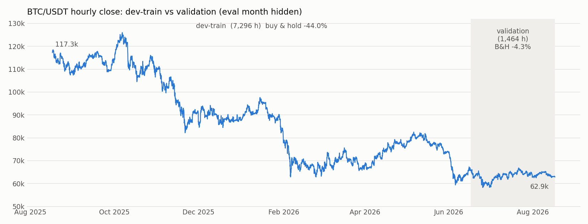
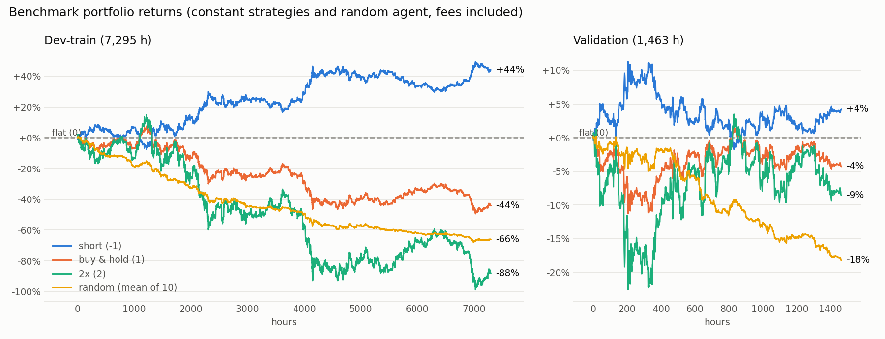
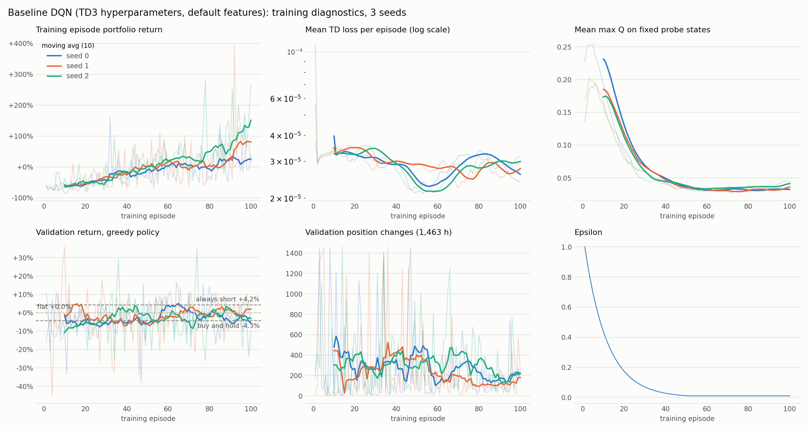
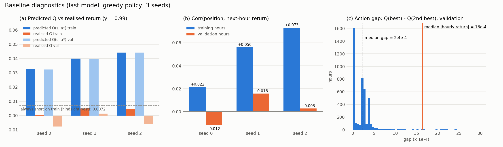
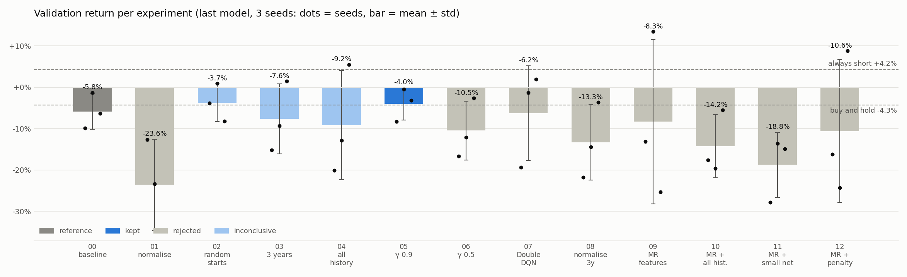
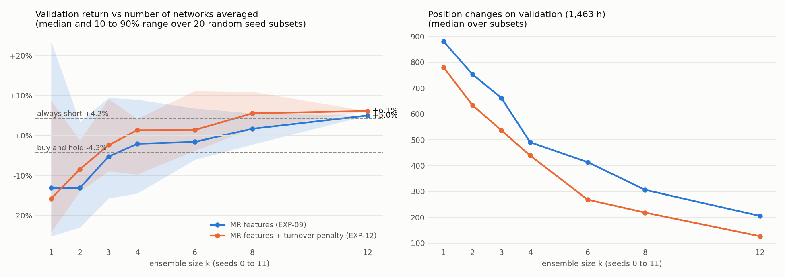
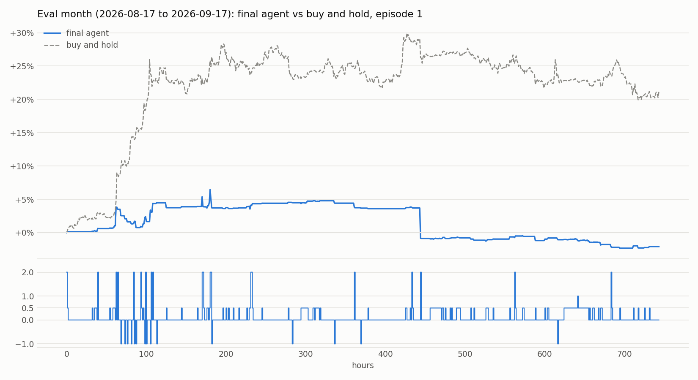
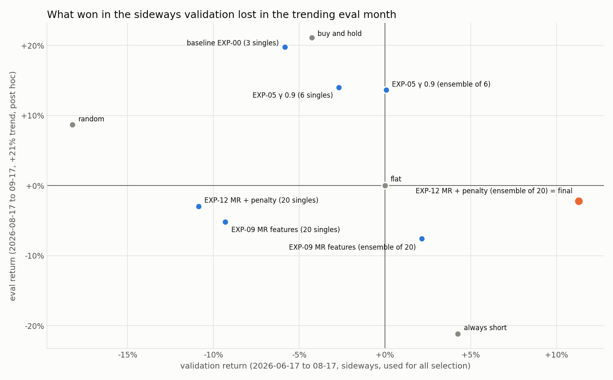

# Deep Reinforcement Learning for BTC/USDT Hourly Trading

Final project for *Intermediate Deep Learning: Deep Reinforcement Learning* (Albert School / Mines Paris PSL).
A Deep Q-Network agent, implemented from scratch in PyTorch in the style of the course labs, trades BTC/USDT on hourly candles in [Gym Trading Env](https://gym-trading-env.readthedocs.io). Fourteen experiments later, the final agent is an ensemble of 20 DQN networks that trades short-term mean reversion.

## TL;DR

| | Validation (2026-06-17 to 08-17, sideways) | Eval month (2026-08-17 to 09-17, +21% trend) |
|---|---|---|
| Buy and hold | -4.27% | +21.12% |
| Always short | +4.24% | -21.12% |
| Baseline DQN (TD3 setup), 3 seeds | -5.83% ± 4.33% | +22.61% (official seed 0) |
| **Final agent (20-network DQN ensemble)** | **+11.28%** (Sharpe 3.55, max drawdown -3.9%) | **-2.20%** |

- **Best configuration found on validation:** +11.3% against -5.8% for the baseline, with the ensemble effect confirmed on fresh seeds in pre-registered tests. The number is optimistic, because every selection decision used the same two months.
- **On the eval month it did not hold up:** the month was a strong uptrend. Trailing buy and hold is structural (a mostly flat strategy in a +21% month); ending below zero comes from the tails (a 2x position before a sharp drop, contrarian shorts against the rally). The multi-hour mean-reversion signal the agent relies on is not detectable in that month.
- **Main lessons:** two months of sideways validation measured fit to one regime, not skill, so validation has to span several regimes; and with an edge about the size of the fee, leverage only amplifies variance. I submitted the frozen model anyway: choosing the submission after seeing the test result would be data snooping.

## The story

### 1. Problem and environment ([notebook 01](notebooks/01_env_and_data.ipynb))

Every hour the agent chooses a target position from `[-1, 0, 0.5, 1, 2]` (short, flat, half, fully long, 2x leverage). Its reward is the log return of the portfolio over the next hour, after a 0.01% fee on every traded amount.



What I learned before training anything:
- **The data is hard.** Hourly moves are small (median about 0.2%) and nearly uncorrelated from one hour to the next. The course's training year is a strong bear market (-44%), validation moves sideways (-4%).
- **The default features are weak.** `feature_open` duplicates `feature_close` (BTC trades 24/7, so every hour opens at the previous close), and the price ratios are almost constant inputs (std about 0.004 around 1.0).
- **The environment has traps**, all verified with experiments: observations are views into the environment's memory (a replay buffer must copy them), importing the env turns every warning into an exception, the random initial position ignores `env.reset(seed=...)`, borrow interest is effectively not charged, and held positions are not rebalanced.
- **Fees matter.** A random agent loses about 8.4% per month to fees alone.



### 2. Why DQN

The action space is small and discrete (5 positions) and the state is continuous (market features plus the current position), which is exactly what Deep Q-Learning handles: one forward pass gives a Q-value per position. A table would need millions of cells for 7,300 hours of data. The data is scarce and noisy, so sample efficiency matters: DQN is off-policy and its replay buffer reuses every transition many times, while REINFORCE, SARSA, A2C and PPO (all covered in the course) are on-policy and use each experience once or a few times. I use the stabilised DQN of the course: a target network against the moving target and experience replay against correlated samples.

### 3. Baseline and diagnosis ([notebook 02](notebooks/02_baseline_and_analysis.ipynb))

The baseline is the course's TD3 DQN with its hyperparameters (lr 1e-4, γ 0.99, batch 64, buffer 50k, target sync every 250 updates, hidden 128), trained for 100 passes over the training year with 3 seeds. The only adaptation is the ε schedule (same shape as TD3, adapted to long episodes).



It learns the training data (+25% to +151% per pass) but not the market: **-5.8% ± 4.3% on validation.** The diagnostics show why:



- **(a) Overestimation:** the network predicts about 0.039 for its chosen action but realises about -0.004 afterwards. The max over near-identical noisy Q-values is biased upwards, and γ = 0.99 accumulates that bias over about 100 steps.
- **(b) Memorisation:** the position correlates with the next hour's return on the training hours (up to +0.07) and not at all on validation.
- **(c) Decisions by noise:** the best and second-best Q-values differ by a median of 2.4e-4, seven times less than a typical hourly move. Two checkpoints of the same run agree on only 1 to 3% of validation hours.

### 4. Experiments ([notebook 03](notebooks/03_experiments.ipynb), full log in [EXPERIMENTS.md](EXPERIMENTS.md))

One change at a time, 3 seeds each, judged on validation only.



| Step | What I changed | What I measured | Verdict |
|---|---|---|---|
| EXP-01 | z-score input normalisation | the network now resolves states and memorises them (in-sample x42,829), 987 trades | rejected |
| EXP-02 to 04 | random-start episodes, 3 years, all history since 2017 | memorisation falls (in-sample correlation 0.050 → 0.015 → 0.010), but only a constant bet remains | inconclusive |
| EXP-05 / 06 | γ 0.99 → 0.9 / 0.5 | overestimation 0.035 → 0.003; γ 0.5 too short-sighted to pay back fees | 0.9 kept |
| EXP-07 | Double DQN | halves the remaining bias, no gain once γ = 0.9 | rejected |
| EXP-08 / 09 | normalisation, mean-reversion features | the network sees the signal in-sample (correlation 0.23) and memorises it again | rejected |
| EXP-10 to 12 | more data, smaller network, turnover penalty | none stops the memorisation of single networks | rejected as single models |
| EXP-13 / 14 | ensembles of 3 and 6 networks, pre-registered on fresh seeds | ensembles beat their single networks and buy and hold, replicated | ensemble kept |

Two findings shaped the final agent:

- **There is a small, real signal:** short-term mean reversion. The last-hour return, the 4-hour return, the distance to the 24-hour average and the RSI correlate negatively with the next hour's return (about -0.05) on both training and validation data. That is roughly the size of the trading costs.
- **Single networks memorise it; ensembles do not.** Each network fits different noise, so each one is a high-variance estimator. Averaging the Q-values of several networks reduces that variance. The networks disagree least about the flat position (no market exposure) and most about the exposed ones, so averaging shrinks the exposed actions towards a common mean that lies just below flat: the ensemble only takes a position when the networks agree on an edge. Related methods: Averaged-DQN [1] averages earlier Q estimates of one network, Bootstrapped DQN [2] trains several Q heads and can vote across them; here, independently trained networks are averaged when acting.



With more networks in the average, the validation return rises, the spread shrinks and trading falls from about 800 to about 130 position changes.

### 5. Final agent ([notebook 04](notebooks/04_final_and_submission.ipynb))

| Component | Setting |
|---|---|
| Algorithm | DQN with target network and experience replay; greedy action on the average Q-values of 20 networks (seeds 0 to 19) |
| Discount | γ = 0.9 |
| Training data | 2023-04-01 to 2026-06-17 (3.2 gap-free years), random-start episodes of 720 hours |
| Features | last-hour candle and volume, 4-hour return, distance to the 24-hour average, RSI 14h; z-scored with dev-train statistics |
| Training reward | log return minus 0.0005 per unit of position change (training only; evaluation uses the default reward) |
| Model file | [models/final/](models/final/) (1.5 MB) |

On validation: **+11.28%** (month 1 +8.17%, month 2 +2.67%), Sharpe 3.55, max drawdown -3.9%, flat 78% of the time. The 20 networks on their own average -10.9%. Because all selection used this block, +11.28% is the best configuration found on it, not an unbiased estimate of future performance.

On the eval month, with the unchanged course `evaluate_agent`, run once: **-2.20%** ([eval/evaluation_results.csv](eval/evaluation_results.csv)).



### 6. What went wrong on the eval month



After freezing the final model I evaluated every main model on the eval month (post hoc, not used for selection). The ranking is almost the reverse of the validation ranking: long-leaning models win the trend month, the cautious mean-reversion ensembles that won the sideways validation lose slightly, and even a random agent (0.5 long on average) beats the final agent this month.

**Two separate effects:**
- **Trailing buy and hold by about 23 points is structural.** An agent that is flat most of the time cannot keep up with a +21% month.
- **Ending below zero comes from the tails.** The worst hour was a 2x position before a sharp drop (about -4.5%), and contrarian shorts against the rally cost about 2.6% (log). With 2x capped at 1x, the same policy ends the eval month at about 0%; on validation the same cap costs about 3 points (+11.3% → +8.1%). With an edge about the size of the fee, leverage mainly amplifies variance.

**Did the signal survive?** Rank correlation of the features with the next-hour return:

| Feature | Dev-train (3 years) | Validation | Eval month |
|---|---|---|---|
| 4-hour return | -0.051 | -0.060 | -0.020 |
| Distance to the 24-hour average | -0.041 | -0.064 | -0.003 |
| RSI 14h | -0.030 | -0.066 | -0.002 |
| Last-hour return | -0.062 | -0.031 | -0.072 |
| 168-hour return | -0.006 | -0.023 | -0.021 |
| Noise (2 standard errors) | ±0.012 | ±0.052 | ±0.073 |

The multi-hour mean reversion the agent is built on was stronger on validation than on the 3-year average, and it is not detectable on the eval month; only the one-hour reversal remains. One month is too noisy to prove that the signal vanished, but the result is consistent with it, and it explains why validation overstated the edge.

**No trend information in the state.** No feature predicts trends: the 168-hour return has no correlation with the next hour in any period, including the trend month. The models that won the eval month were near-constant long bets (arbitrary per seed in the baseline), not trend-followers.

### 7. Lessons

- **Validate across regimes.** Walk-forward validation over several blocks (bull, bear, sideways) and keep only configurations that hold up in all of them. Fresh seeds protect against seed luck, not against overfitting one validation block.
- **No leverage on a fee-sized edge.** Leverage added about 3 points on validation and cost about 2 on the eval month: it amplified variance, not the edge.
- **Measure mechanisms, not only returns.** With seed spreads of ±5 to ±20 points, returns alone rarely separate two configurations; diagnostics such as overestimation and in-sample vs out-of-sample correlation told me why something worked or failed.
- **Pre-register decisive tests.** The ensemble effect was confirmed on fresh seeds with criteria committed before training. It also exposed a lucky early number (+14% for 6 networks that became -3% on fresh seeds).
- **Variance is the enemy in noisy markets.** Single DQN networks were high-variance estimators; ensembling was the only regulariser that worked, by shrinking uncertain exposed actions towards flat.
- **Report what happened.** The frozen model was submitted as it was.

## Evaluation protocol

| Split | Period (UTC, end exclusive) | Use |
|---|---|---|
| Training (final config) | 2023-04-01 to 2026-06-17 | the networks learn from it |
| Validation | 2026-06-17 to 2026-08-17 | all model selection |
| Eval (fixed by the course) | 2026-08-17 to 2026-09-17 | run once for the baseline, once for the final model |

Every use of the evaluation window and every design decision is recorded in [PROJECT_LOG.md](PROJECT_LOG.md).

Data: Binance BTCUSDT 1h klines through the public market-data API (downloaded and validated automatically). Environment: `gym-trading-env` 0.3.5 with 0.01% fees and 0.0003% borrow rate per hour. The agent is the course's DQN (target network and experience replay), implemented from scratch with an ensemble of Q-networks on top; no RL libraries.

## Reproduce

```bash
conda create -n btc-rl python=3.12
conda activate btc-rl
pip install -r requirements.txt
pip install ipykernel            # to run the notebooks

# Train one experiment with seeds 0, 1, 2 in parallel (data is downloaded on first use)
scripts/run_experiment.sh configs/baseline.json

# The final agent: EXP-12 with seeds 0 to 19, then freeze the ensemble
scripts/run_experiment.sh configs/exp12_mr_turnover_penalty.json 0 1 2 3 4 5 6 7 8 9 10 11 12 13 14 15 16 17 18 19
python scripts/freeze_final_model.py

# The submission CSV from the frozen model: run notebooks/04_final_and_submission.ipynb
```

Runs are reproducible for a given seed on the same setup (CPU, one thread per run): the environment's randomness is seeded through `np.random`, and the agent draws exploration and replay samples from its own seeded generators.

## Repository structure

```
rl_trading/        importable code
  data.py          download, validation, features, splits, normalisation
  envs.py          environment factories, training-only turnover penalty
  networks.py      Q-network (as in the course labs)
  replay.py        replay buffer (numpy ring buffer)
  agents.py        DQN, Double DQN, ensemble, save and load
  train.py         training loop, logging, checkpoints (CLI)
  evaluate.py      benchmarks, validation, diagnostics, the course's evaluate_agent, plots
configs/           one config per experiment
runs/              training and validation logs per experiment and seed (weights not committed)
models/final/      the frozen final ensemble, its config and normalisation statistics
notebooks/         01 environment and data, 02 baseline and analysis, 03 experiments, 04 final model and submission
eval/              evaluation_results.csv (final), baseline CSVs, post hoc comparison
figures/           all figures, generated by the notebooks
scripts/           experiment launcher, freeze script
EXPERIMENTS.md     every experiment with hypothesis, result and verdict, including failures
PROJECT_LOG.md     decisions with rationale, every run on the eval window
```

## References

1. O. Anschel, N. Baram, N. Shimkin. *Averaged-DQN: Variance Reduction and Stabilization for Deep Reinforcement Learning.* ICML 2017.
2. I. Osband, C. Blundell, A. Pritzel, B. Van Roy. *Deep Exploration via Bootstrapped DQN.* NeurIPS 2016.
